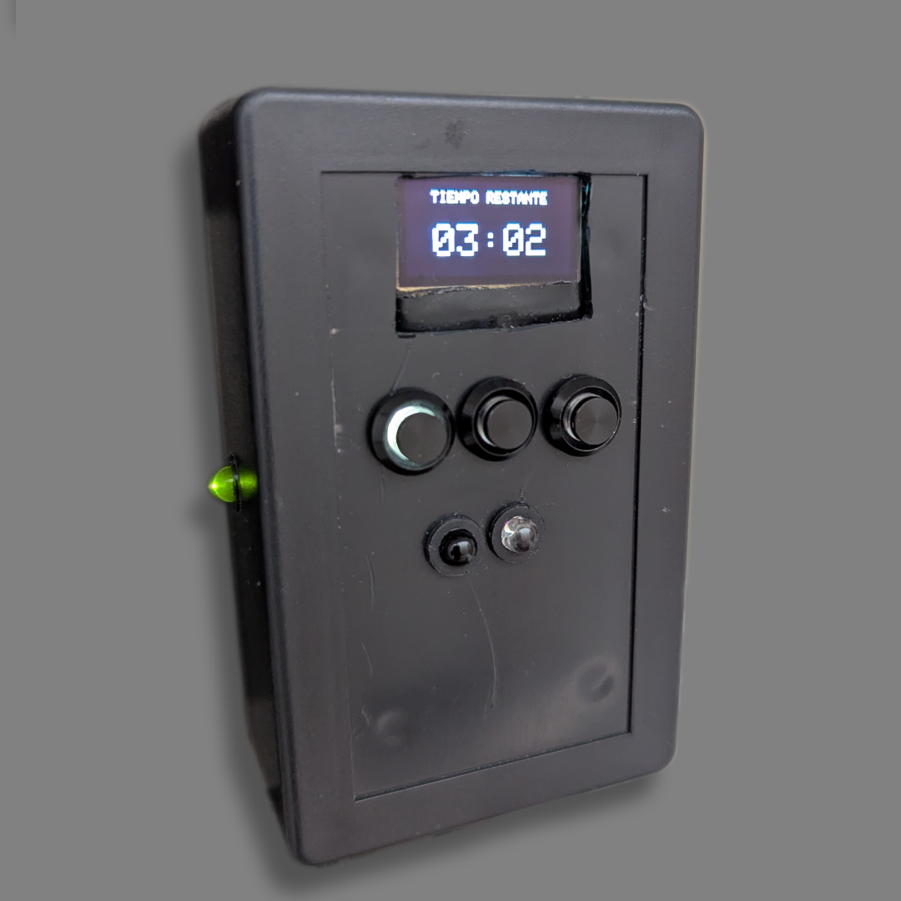

# water-pump-timer-esp32-mqtt

An upgraded version of [water-pump-timer-esp32](https://github.com/TonyQuezada/water-pump-timer-esp32), rebuilt around MQTT. The ESP32 no longer hosts a web server — instead it connects to a Mosquitto broker running on a local Debian server, which also hosts a Next.js web application. This separation makes the system more robust and allows for user authentication, event logging, and remote access over HTTPS.

The project was built to fill a water reservoir tank that takes roughly 6 hours to fill. Because the pump runs unattended, the web interface shows live water flow data so you can verify water is actually moving when you are not around. The physical device and the web interface stay fully in sync — a button press on either one is immediately reflected on the other. Adding an automatic shutoff triggered by zero flow is possible with a small code change, but was not needed for this use case.

The maximum timer duration is set by the `MAX_HOURS_TIMER` constant in the firmware. If you change it, update the hour buttons in `timer-webserver/app/components/PumpControl.tsx` to match.

---

<p align="center">
  
</p>

<table align="center">
  <tr>
    <td></td>
    <td></td>
    <td></td>
  </tr>
</table>

---

## Hardware

| Component | Notes |
|---|---|
| ESP32 | Main microcontroller |
| 3× Push buttons with ring LED backlight | Each button has an integrated LED that blinks to reflect the current device state |
| SSD1306 OLED display | Shows timer selection and remaining time |
| IR proximity sensor | Wakes the display when a hand gets close, preventing OLED burn-in |
| Power indicator LED | Always-on LED showing the device is live |
| YF-S201 water flow sensor | Measures flow in litres per hour via pulse counting |
| Relay module (Normally Open) | Switches the pump on and off |

### Protection circuits

**Relay driver — optocoupler circuit**
The relay is driven through an optocoupler to electrically isolate the ESP32 from the relay coil.

**Relay — snubber circuit**
A 100 Ω ½ W resistor in series with a 0.1 µF 250 V polyester capacitor is connected across the relay's COM and NO pins. This suppresses the voltage spike produced when the relay opens under load, protecting the ESP32 from transient interference.

**Power supply — decoupling capacitors**
A 1000 µF electrolytic capacitor in parallel with a 0.1 µF ceramic capacitor is connected between the 5 V and GND rails. This combination filters both low-frequency and high-frequency noise on the supply line, preventing the ESP32 from browning out or resetting when the relay switches.

---

## Pin map

| Pin | Assignment |
|---|---|
| 16 | OFF button |
| 17 | SELECTOR button |
| 5 | OK button |
| 15 | OFF button LED |
| 2 | SELECTOR button LED |
| 4 | OK button LED |
| 19 | Power indicator LED |
| 18 | IR sensor |
| 23 | Relay |
| 25 | YF-S201 flow sensor |

---

## How it works

### Physical controls

Three buttons control the device:

- **SELECTOR** — cycles through available durations (1 → 2 → … → `MAX_HOURS_TIMER` hours) while the pump is off.
- **OK** — starts the pump for the selected duration.
- **OFF** — stops the pump immediately at any time.

Each button's ring LED blinks in patterns that reflect the current device state, so the status is readable at a glance without looking at the screen.

### OLED display

The display shows the selected duration while in standby, and remaining time (`HH:MM`) while the pump is running. It is driven by the IR sensor: it activates when a hand is detected nearby and switches off after 30 seconds of inactivity, preventing OLED burn-in.

### State synchronization

The ESP32 is the single source of truth. Any state change — whether triggered by a physical button or a web command — is published to the MQTT broker and immediately reflected on both the device and the web interface.

---

## MQTT

A Mosquitto broker runs on the Debian server on the same local network as the ESP32. All communication between the firmware and the web application goes through it.

### Topic structure

| Topic | Direction | Payload example |
|---|---|---|
| `waterpump/device/status` | ESP32 → server | `{"mode":1,"isRunning":true,"remainingSeconds":7200,"hourIndicator":1}` |
| `waterpump/device/flow` | ESP32 → server | `{"lph":45.2}` |
| `waterpump/device/button` | ESP32 → server | `{"button":"ok","hours":3}` |
| `waterpump/control/button` | server → ESP32 | `{"button":"ok","hours":3}` |

The ESP32 publishes flow every second and status every 5 seconds. It also publishes immediately on any state change. The `waterpump/device/status` topic is published with `retain=true` so the web interface gets the latest state instantly on connect.

### Flow calculation

The YF-S201 sensor pulses on every unit of flow. An interrupt service routine counts pulses and the flow rate is calculated once per second using the sensor's formula:

```
L/hour = pulses × 60 / 7.5
```

---

## Web server

The Next.js application runs on a Debian 13 server (Intel i7-7700, 8 GB RAM) and is served over HTTPS via Caddy, which handles SSL certificate management automatically through Let's Encrypt. The app is managed by PM2 and starts automatically on boot.

### Authentication

Login is required to access the interface. Users are stored in a local SQLite database with bcrypt-hashed passwords. New users can only be added via a CLI script — there is no registration page.

Admin users have access to an event log panel showing all button presses, their source (physical or web), and which user triggered them.

### Real-time updates

The web interface receives live data through Server-Sent Events (SSE). The Next.js server maintains a persistent MQTT connection and forwards incoming messages to all connected browser clients in real time. Button commands from the web are sent via a POST request to the API, which publishes them to the broker.

### PWA

The app includes a web manifest, making it installable on Android via Chrome's "Add to Home Screen" prompt. On iOS, use "Add to Home Screen" from the Safari share menu. Note that without a service worker the app requires an active connection to function — there is no offline support.

---

## Project structure

```
water-pump-timer-esp32-mqtt/
├── timer-v3/
│   └── timer_v3.ino              — ESP32 firmware
└── timer-webserver/              — Next.js web application
    ├── app/
    │   ├── api/
    │   │   ├── auth/
    │   │   │   └── [...nextauth]/
    │   │   │       └── route.ts  — next-auth handler
    │   │   ├── logs/
    │   │   │   └── route.ts      — event log endpoint (admin only)
    │   │   └── mqtt/
    │   │       └── route.ts      — SSE stream + control commands
    │   ├── components/
    │   │   └── PumpControl.tsx   — main UI client component
    │   ├── login/
    │   │   └── page.tsx          — login page
    │   ├── layout.tsx
    │   ├── manifest.ts           — PWA manifest
    │   └── page.tsx              — root page (server component)
    ├── lib/
    │   ├── auth.ts               — next-auth config
    │   ├── db.ts                 — SQLite schema and queries
    │   └── mqttClient.ts         — MQTT singleton
    ├── middleware.ts             — route protection
    ├── scripts/
    │   └── manage-users.ts       — CLI to add/delete users
    └── ecosystem.config.js.txt   — PM2 config template (rename and fill credentials)
```

---

## Setup

### Network setup

Both the ESP32 and the Debian server use static local IPs assigned through the router's DHCP reservation feature — this ensures their addresses never change without touching any code. The router assigns a fixed IP to each device based on its MAC address.

The server is also accessible remotely via a DuckDNS dynamic DNS domain, which keeps the public URL stable even though the ISP assigns a dynamic public IP. This setup is not covered here.

### 1. Mosquitto broker

**Install:**

```bash
sudo apt update
sudo apt install mosquitto mosquitto-clients
```

**Configure** — create a new config file:

```bash
sudo nano /etc/mosquitto/conf.d/waterpump.conf
```

Paste the following:

```
listener 1883
allow_anonymous false
password_file /etc/mosquitto/passwd
```

**Create credentials** for two clients — one for the ESP32 and one for Next.js:

```bash
# -c creates the file, omit -c for additional users
sudo mosquitto_passwd -c /etc/mosquitto/passwd esp32
sudo mosquitto_passwd /etc/mosquitto/passwd nextjs
```

**Fix permissions** so Mosquitto can read the password file:

```bash
sudo chown mosquitto:mosquitto /etc/mosquitto/passwd
sudo chmod 640 /etc/mosquitto/passwd
```

**Enable and start:**

```bash
sudo systemctl enable mosquitto
sudo systemctl start mosquitto
```

**Test** — open two terminals. In the first, subscribe to a test topic:

```bash
mosquitto_sub -h localhost -p 1883 -u nextjs -P yourpassword -t "test"
```

In the second, publish a message:

```bash
mosquitto_pub -h localhost -p 1883 -u esp32 -P yourpassword -t "test" -m "hello"
```

If `hello` appears in the first terminal, the broker is working. Also verify the broker is reachable from other devices on the network by using the server's LAN IP instead of `localhost` in the above commands.

### 2. ESP32 firmware

Open `timer-v3/timer_v3.ino` in the Arduino IDE with ESP32 board support installed and fill in your credentials:

```cpp
const char* ssid          = "YOUR_SSID";
const char* password      = "YOUR_PASSWORD";
const char* mqtt_server   = "YOUR_BROKER_IP";
const char* mqtt_password = "YOUR_MQTT_PASSWORD";
```

Install the required libraries via the Arduino Library Manager:
- PubSubClient by Nick O'Leary
- Adafruit SSD1306
- Adafruit GFX
- Bounce2

### 3. Web server

Install dependencies:

```bash
cd timer-webserver
npm install
```

Rename `ecosystem.config.js.txt` to `ecosystem.config.js` and fill in your credentials:

```javascript
module.exports = {
  apps: [{
    name: "waterpump",
    script: "npm",
    args: "start",
    instances: 1,
    exec_mode: "fork",
    env: {
      NODE_ENV:        "production",
      MQTT_HOST:       "YOUR_BROKER_IP",
      MQTT_PORT:       "1883",
      MQTT_USER:       "nextjs",
      MQTT_PASSWORD:   "YOUR_MQTT_PASSWORD",
      AUTH_SECRET:     "YOUR_AUTH_SECRET",        // generate with: node -e "console.log(require('crypto').randomBytes(32).toString('hex'))"
      AUTH_URL:        "https://YOUR_DOMAIN",
      AUTH_TRUST_HOST: "true",
    }
  }]
}
```

Create your admin user:

```bash
npm run manage-users add yourusername yourpassword --admin
```

Build and start:

```bash
npm run build
pm2 start ecosystem.config.js
pm2 save
pm2 startup
```

### 4. Caddy (HTTPS)

Install Caddy and configure `/etc/caddy/Caddyfile`:

```
yourdomain.com {
    reverse_proxy localhost:6868
}
```

```bash
sudo systemctl enable caddy
sudo systemctl start caddy
```

Caddy obtains and renews SSL certificates automatically. Forward ports 80 and 443 on your router to the server.

---

## User management

```bash
# Add a regular user
npm run manage-users add username password

# Add an admin user
npm run manage-users add username password --admin

# Delete a user
npm run manage-users delete username

# List all users
npm run manage-users list
```

---

## Dependencies

### ESP32
- [PubSubClient](https://github.com/knolleary/pubsubclient) by Nick O'Leary
- [Adafruit SSD1306](https://github.com/adafruit/Adafruit_SSD1306)
- [Adafruit GFX](https://github.com/adafruit/Adafruit-GFX-Library)
- [Bounce2](https://github.com/thomasfredericks/Bounce2)
- ESP32 Arduino core

### Web server
- [Next.js](https://nextjs.org/)
- [next-auth](https://authjs.dev/)
- [MQTT.js](https://github.com/mqttjs/MQTT.js)
- [better-sqlite3](https://github.com/WiseLibs/better-sqlite3)
- [bcryptjs](https://github.com/dcodeIO/bcrypt.js)
- [Tailwind CSS](https://tailwindcss.com/)
- [PM2](https://pm2.keymetrics.io/)
- [Caddy](https://caddyserver.com/)
